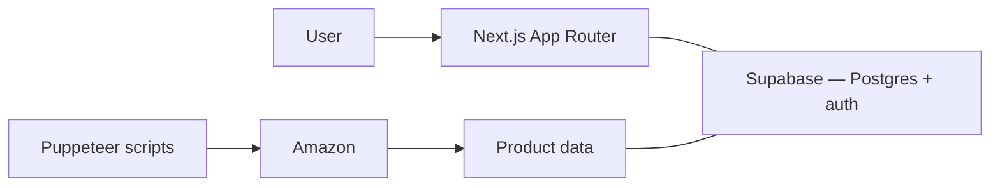

Dropit is an ecommerce margin tool: it tracks products across multiple domains, compares their pricing, and surfaces where the best margin is. It's deployed at [drop-it-lake.vercel.app](https://drop-it-lake.vercel.app/) with real users.

## What it does

- Tracks the same product across several domains and compares their pricing.
- Surfaces where the best margin is.
- Selects products automatically across thousands of them.

## How it's built

- Next.js with the App Router and TypeScript, TailwindCSS with Shadcn-UI for the interface.
- PostgreSQL on Supabase for product data and user management.
- Puppeteer drives a real browser against Amazon to automate product selection across 1,000s of products; the app scales to 100+ concurrent users.
- Optimizing those scraper scripts saved hundreds of hours of manual data retrieval.
- Migrated authentication from NextAuth to Supabase and cut auth latency 50%. <Todo>how the 50% was measured — what you timed, and before/after in ms.</Todo>

## Tradeoffs

- Supabase Auth ties identity to the platform that holds the data. NextAuth was provider-agnostic; leaving Supabase now means doing an auth migration again.
- Scraping with a real browser gets coverage no API hands over, and pays for it in upkeep — the scripts depend on page structure, not a contract.

## Demo

<TodoBlock />
