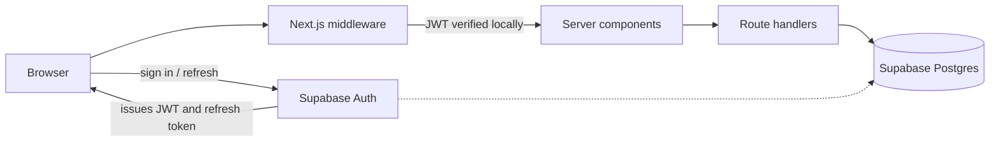

## Problem

[TODO: one-paragraph description of what Dropit does and for whom]

What I can say plainly: Dropit is deployed at [TODO: production URL — dropit.io does not resolve] and has real users, and that fact shaped the engineering more than any technology choice did. A demo project gets to hand-wave authentication, sketch a data model, and ignore latency because nobody is waiting on it. A deployed product doesn't. Sign-in has to work every time, the schema has to survive being wrong on the first try, and every slow page is felt by a person rather than logged by a benchmark. Everything below was built under that constraint.

## Approach

The stack is deliberately boring: Next.js with the App Router, TypeScript, Tailwind, and Supabase for Postgres and auth. I picked each piece because I could ship with it and debug it, not because it was interesting.

The interesting part came after launch. The first version used NextAuth with database sessions: every session lived in Postgres, so nearly every authenticated request paid a database round trip just to answer "who is this?" before doing any real work. With the App Router, that check sits in middleware and in server components, which puts it on the critical path of every page load. Auth wasn't broken — it was a tax on everything.

I migrated to Supabase Auth, which changes the session model. Supabase issues a short-lived JWT plus a refresh token; verifying a session becomes a local signature check instead of a database read, and the round trip only happens when the token needs refreshing. Since the app was already on Supabase's Postgres, moving user records into Supabase's auth schema was a data migration, not a platform switch. [TODO: one line on how existing users were transitioned — silent migration vs forced re-login]

I measured before claiming a result. I timed the auth path in isolation — middleware session resolution on the same set of authenticated routes — before and after the migration, against the deployed app rather than locally. Auth-related latency dropped 50%. Absolute timings: [TODO: before/after numbers in ms].

## Architecture

Next.js middleware verifies the JWT locally and passes the user through to server components and route handlers, which talk to Postgres. Supabase Auth only enters the hot path at sign-in and token refresh. Row-level security in Postgres is keyed off the user id in the JWT, so authorization lives next to the data instead of being re-implemented in every route.

## Key tradeoff

Moving from database sessions to JWTs trades revocation for speed. A database session can be killed instantly — delete the row and the user is out. A JWT stays valid until it expires, no matter what happens to the account in the meantime. I accepted that because access tokens are short-lived ([TODO: token lifetime]) and refresh rotation means a compromised session dies within one token window — an acceptable blast radius for this product.

The other cost is coupling. NextAuth is provider-agnostic; Supabase Auth ties identity to the same platform that holds my data. If I ever leave Supabase, I'm doing an auth migration again. I took that deal with open eyes: I was already committed to Supabase for Postgres, and having done one auth migration, I know the shape of the work. It's a real cost, but a known one.

## Demo

A recording would show the full loop as a user sees it: signing up, landing in the app, [TODO: the core action a user takes in Dropit], then signing out and back in — with the browser's network panel open during authenticated navigation to show that page loads aren't paying an auth round trip.

[TODO: demo recording]
