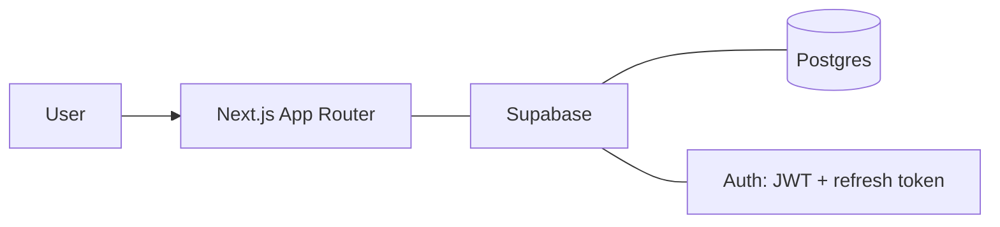

## Problem

Dropit is an ecommerce helper for people whose margin lives in the spread. It tracks a set of products across multiple domains, compares their pricing, and surfaces where the best margin is. The work it replaces is the manual version of exactly that: keeping a list of items, checking them across the same handful of sites, and redoing the arithmetic every time a price moves.

The fact that shaped the engineering most isn't a technology choice. Dropit is deployed at [drop-it-lake.vercel.app](https://drop-it-lake.vercel.app/) and has real users. A demo project gets to hand-wave authentication and ignore latency, because nobody is waiting on it. A deployed product doesn't: sign-in has to work every time, and every slow page is felt by a person rather than logged by a benchmark.

## Approach

The stack is deliberately boring: Next.js with the App Router, TypeScript, Tailwind, and Supabase for Postgres and auth. I picked each piece because I could ship with it and debug it, not because it was interesting.

The decision worth writing down is the auth migration. I moved authentication from NextAuth to Supabase Auth, and what pushed me there was auth latency. <Todo>the actual symptom and what you traced it to. NextAuth supports both JWT and database sessions, so say which you were on and why it was slow.</Todo>

Some background on why the destination looked better independent of that diagnosis: Supabase Auth is token-based. It issues a short-lived JWT plus a refresh token, so verifying a session is a local signature check rather than a database read, and the network round trip only happens when the token needs refreshing. That is how the vendor works, not something I built. It also meant identity and data ended up on one platform rather than two. <Todo>how existing users were transitioned — silent migration or forced re-login.</Todo>

After the migration, auth-related latency dropped 50%. That number is real, and it's the reason the work was worth doing. <Todo>how you measured it — what you timed, on which routes, local or deployed, plus before/after numbers in ms.</Todo>

## Architecture

The parts are an App Router front end and Supabase providing both Postgres and auth. Supabase Auth stays off the request path except at sign-in and token refresh, which is a property of token-based auth rather than a design of mine. I've drawn the pieces and left the wiring undirected on purpose — the exact data path is one of the things I'd have to check before claiming it.

Three things belong on that diagram and aren't there, because I'd rather leave a box empty than draw a design I haven't verified. <Todo>what actually reads and writes Postgres — the server side, or the browser through the Supabase client.</Todo> <Todo>where session verification runs — middleware, server components, or both.</Todo> <Todo>where authorization is enforced — row-level security in Postgres, checks in route handlers, or a mix.</Todo> Between them that's the whole request-and-authorization story.

## Key tradeoff

Token-based sessions trade revocation for speed. A server-side session record can be killed instantly — delete it and the user is out. A JWT stays valid until it expires, no matter what happens to the account in the meantime. That's the deal Supabase Auth makes, and I took it knowingly for a product where sign-in speed is felt on every page and account compromise is rare.

What bounds the damage is token lifetime and refresh behavior, which is configuration rather than architecture. <Todo>token lifetime and whether refresh rotation is on — that sets the real blast radius.</Todo> Until that's written down, "short-lived" is a word, not a number.

The other cost is coupling. NextAuth is provider-agnostic; Supabase Auth ties identity to the same platform that holds the data. If I ever leave Supabase, I'm doing an auth migration again. I took that deal with open eyes: I was already committed to Supabase for Postgres, and having done one auth migration, I know the shape of the work. It's a real cost, but a known one.

## Demo

A recording would show the loop as a user sees it: signing in, then the thing the product is actually for — a set of products compared across domains with the best margin surfaced. <Todo>how products get into the tracked set, and what the comparison view shows.</Todo>

I'd also want it to cover authenticated navigation, since sign-in speed is the engineering claim on this page and a demo that skips it is arguing for itself. <Todo>whether there's a before/after worth showing, or just current behavior.</Todo>

<TodoBlock />
