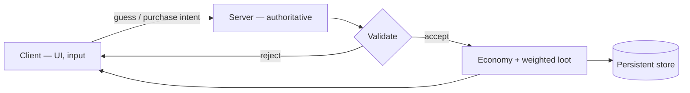

A live multiplayer Roblox game I built and shipped solo — server logic, client UI, data persistence, monetization, and marketing were all mine. 9,000+ players have played it.

## What it does

- Turn-based multiplayer rounds, holding 60 concurrent players at peak. <Todo>the actual round loop — what a player sees on their turn and how a guess resolves.</Todo>
- A persistent virtual economy: balances and items survive across sessions.
- Loot drops resolved from weighted-probability tables.
- In-game purchases, which have generated $100.

## How it's built

- Luau in Roblox Studio, with assets modeled in Blender.
- The client is untrusted. It renders and sends intent; every guess and every purchase is validated on the server before it counts.
- Turn state lives on the server too — the client is told whose turn it is, it doesn't decide.
- Economy writes go through server-side transaction handling, so a balance can't be rewritten by a tampered client.

## Tradeoffs

- Server authority costs a round trip before anything a player does becomes visible. On a platform where client exploits are the norm, that latency is worth paying for.
- $100 is small money. What it demonstrates is a purchase path that works end to end — validate, grant, persist — not a business.

## Demo

<TodoBlock />
