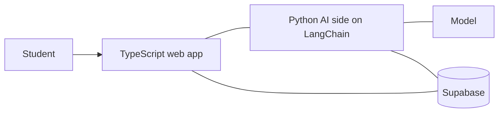

## Problem

StudyMonkey is an AI study tool. A student brings their own documents, asks questions against them, and gets flashcards back out of the same material. It is deployed and has real users — <Todo>user count and who they are</Todo> — which matters to me more than any feature list. A project nobody uses teaches you about code; a project with users teaches you about software.

The hard constraint of the domain is that wrong answers are worse than no answers. A chatbot that invents a plausible fact is annoying. A study tool that does it teaches someone the wrong thing the night before an exam. Everything below is downstream of that.

## Approach

The first decision any LLM product forces is how much of the model's context you control. Course material is routinely longer than a context window you want to pay for, and every way out is a tradeoff: send everything and eat the cost, pull only the passages that look relevant and risk skipping the one that mattered, or condense ahead of time and inherit whatever the condensing dropped. LangChain is the orchestration layer here; it makes any of those cheap to build, which also means it decides none of them for you. <Todo>which of these StudyMonkey does to get document text in front of the model, and what pushed you there.</Todo>

Second, budgets. Model calls are not free and not instant, and a student will not sit and watch a page think. Cost and latency are design inputs in a product like this, not numbers you measure afterward and apologize for. <Todo>whether you set an explicit per-request cost or latency target, and what you traded to hold it — model tier, streaming, caching repeated generations.</Todo>

Third, quality checking. "It looked fine when I tried it" does not survive a prompt change. Model output moves in ways that read as an improvement on the two examples you have open and quietly degrade on the cases you are not looking at. The only defense I know is a fixed set of inputs you re-run before shipping rather than after a complaint. <Todo>whether you have anything like this today — fixed inputs, a rubric, a check before deploys — and what it has caught.</Todo>

## Architecture

Two languages, split along the seam where change happens. The web side is a TypeScript web app. The AI side is Python, with LangChain as the orchestration layer, calling a model <Todo>which model and provider.</Todo> Supabase is the third piece <Todo>what Supabase handles — auth, Postgres, document storage — and which side talks to it.</Todo> The edges above are drawn undirected because the integration path is exactly what I'd want to confirm before drawing an arrow. <Todo>how the web side and the Python side actually talk — HTTP, a queue, or something else.</Todo>

Keeping the model work out of the web app is the part I would defend hardest. Prompts and chains change far more often than screens do, and I did not want a prompt experiment to mean a frontend deploy. It also lets the two halves be reasoned about separately: the web app has a normal product's failure modes, and the Python side has an LLM's.

## Key tradeoff

The tradeoff I keep coming back to is hallucination safety against cost and latency. The safest version of a pipeline like this checks its own work: constrain every claim to the source text, run a second model pass over the output, filter hard on anything unsupported. Each of those steps adds seconds and cents to every request, and past some point a student closes the tab and opens the PDF instead. None of them drives the error rate to zero either — they make errors rarer and change which kinds get through.

<Todo>where you actually landed — what constrains generation, whether anything checks the output, and what that cost in latency or spend.</Todo>

What I am confident about is the framing. Pretending the error rate is zero is the worse failure, because it puts the burden of doubt on someone studying precisely because they do not know the material yet. A tool that shows where an answer came from makes it cheap to catch being wrong. A confident voice with nothing behind it makes the same error unfalsifiable.

## Demo

A recording would show the loop a student actually runs: <Todo>getting material in — upload or paste,</Todo> asking a question against it, then generating a deck from the same material. It would also show the unhappy path, because that is the part of an LLM product most demos hide. <Todo>what a student sees when a generation fails or the tool has no good answer.</Todo>

<TodoBlock />
