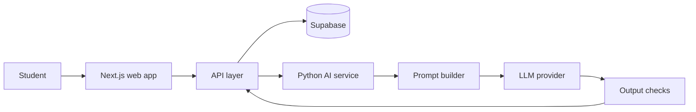

## Problem

StudyMonkey is an AI-powered study tool that [TODO: one sentence on what it does for students — e.g. turns course material into practice questions, flashcards, or explanations]. It is deployed and has real users — [TODO: user count and who they are] — which matters to me more than any feature list. A project nobody uses teaches you about code; a project with users teaches you about software.

The hard constraint of the domain is that wrong answers are worse than no answers. A chatbot that hallucinates a plausible fact is annoying. A study tool that does it teaches someone the wrong thing the night before an exam. That constraint shaped almost every decision below.

## Approach

The first decision any LLM product forces is how much of the model's context you control. I could pack everything into a carefully built prompt, or add retrieval so the model only sees the material relevant to the request. I went with [TODO: prompt-only, retrieval, or hybrid — what StudyMonkey actually does] because [TODO: the reason — size of typical study material, early quality testing, cost]. This choice looks academic until you watch output quality change as the context fills up.

Second, budgets. Every request to a hosted model costs real money and real time, and a student will not wait long for a page to do something. I set a per-request budget — [TODO: target latency and cost ceiling] — and made the choices needed to stay under it: [TODO: e.g. model tier, streaming output, caching repeated generations].

Third, evals. "It looked fine when I tried it" is not quality checking. Before trusting any prompt change, I ran it against [TODO: the eval setup — a fixed set of representative inputs, a rubric, regression checks before deploys]. It is a small harness, but it caught changes that read as improvements and quietly degraded output.

## Architecture

The web side is TypeScript: a Next.js app with Supabase handling [TODO: what Supabase handles — auth, Postgres, file storage]. The AI side is Python: a service that owns prompt construction, calls to [TODO: model and provider], and post-processing before anything reaches a student. Keeping model logic out of the web app was deliberate — prompts change far more often than UI, and I wanted to iterate on them without touching the frontend.

## Key tradeoff

The tradeoff I spent the most time on: hallucination safety versus cost and latency. The safest pipeline verifies every generation — grounding checks against source material, a second model pass, aggressive filtering. Each of those steps adds seconds and cents to every request, and past a point students just leave.

I landed on [TODO: the actual mitigation — constraining generation to provided material, second-pass checks only on flagged output, visible sourcing] and accepted [TODO: what that cost — added latency, higher per-request spend, or a known residual error mode]. I also decided to be honest in the product rather than pretend the error rate is zero: [TODO: what the user sees — source attribution, a report control, wording that explains the failure mode]. Some errors still get through. Knowing which kinds, and making them cheap for a student to catch, was the real work.

## Demo

A demo recording would show the full loop as a student sees it: signing in, [TODO: providing material — upload or paste], generating [TODO: the output type], and the result streaming back inside the latency budget. It would also show the unhappy path — what appears when a generation is flagged or fails — because that is the part of an LLM product most demos hide.

[TODO: demo recording]
