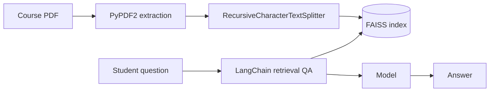

StudyMonkey turns a student's own course PDFs into an interactive chat session and a flashcard deck built from the same material. It's deployed and has supported 1,100+ students.

## What it does

- Upload a course PDF and ask questions against it — answers come from the document, not the model's memory.
- Generates flashcards from the same uploaded material.
- Handles documents up to 500 pages.

## How it's built

- One Streamlit app in Python, end to end. No separate API, no second service to deploy.
- PyPDF2 extracts the text; RecursiveCharacterTextSplitter breaks it into chunks.
- Chunks go into a FAISS index. LangChain's retrieval-based Q&A pipeline pulls the matching passages and puts only those in front of the model.
- That path retrieves the right passage 95% of the time.
- <Todo>which model and provider sit behind the answers.</Todo>

## Tradeoffs

- The 95% has a failure mode attached: on the other 5%, the model answers from what it was handed rather than from the passage that mattered.
- Chunk size is the lever that shapes retrieval quality: too small severs a definition from its qualifier, too large drags unrelated lecture into every hit.
- A single Streamlit app costs separation: a prompt experiment and a layout change are the same deploy. The trade buys one language and one repo.

## Demo

<TodoBlock />
