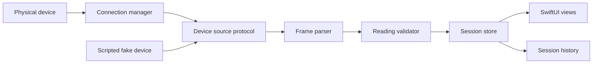

## Problem

Every simulator lies to you. It has perfect connectivity, clean data, and no battery. I built VitalEdge because I wanted one project in my portfolio where the app is only correct if it works against a physical device — no mocks standing in for the hard part. VitalEdge is an iOS app, written in SwiftUI, that connects to [TODO: what the hardware is and what the app reads from it] and turns its raw output into something a person can actually read on their phone.

The problem isn't rendering the data. It's everything upstream of the view: a device that disconnects mid-session, readings that arrive malformed or out of order, and an OS that will happily suspend your app while the hardware keeps transmitting.

## Approach

I treated the device connection as the product, not as a data source. Concretely, that meant designing for four failure modes the simulator never shows you:

- **Session lifecycle.** The [TODO: connectivity protocol, e.g. BLE] link drops constantly in the real world — range, interference, the phone locking. Connection state is an explicit state machine (scanning, connecting, streaming, reconnecting, failed), not a boolean, and every view renders something sensible in every one of those states.
- **Flaky data.** Real hardware sends garbage sometimes: partial frames, out-of-range values, duplicates after a reconnect. Every reading passes through a validation layer before it touches app state, and rejected frames get counted rather than silently dropped, so I could see how noisy the device actually was.
- **Async streams in SwiftUI.** Device output is modeled as an AsyncStream consumed by a single observable session store. Views never talk to the connection layer; they render the store. That kept Swift concurrency honest and made "what happens if a reading arrives mid-reconnect" a question with one answer instead of five.
- **Testing without the device.** I had [TODO: how many hardware units] on my desk, and it can't ride along in CI. More on that below.

## Architecture

The one architectural decision that mattered: everything downstream of the connection manager depends on a small device-source protocol, not on framework types. The real implementation wraps [TODO: the iOS framework used, e.g. CoreBluetooth]; the fake is a scripted device that can replay recorded sessions, inject malformed frames, and disconnect on cue. The parser, validator, and session store never know which one they're talking to.

## Key tradeoff

That seam costs something. A scripted fake will never reproduce real radio behavior — timing jitter, the OS tearing the connection down under it, the device's quirks after a power cycle — so a whole class of bugs only ever shows up with the hardware physically on the desk. I accepted that. In exchange, parsing, validation, and every state transition in the session store are covered by fast unit tests that run in CI with nothing plugged in, and hardware time gets spent only on the bugs that genuinely need hardware. The alternative — manually testing everything against the device — is how my first week on this project went, and it doesn't scale past one developer with one unit.

## Demo

The recording shows the app on a physical iPhone sitting next to the hardware: pairing from a cold start, live readings streaming into the SwiftUI dashboard, then me deliberately killing the connection ([TODO: how — powering the device off or walking out of range]) and the app riding through it — the reconnecting state shown honestly, no stale data presented as live, and the stream resuming without a restart.

[TODO: demo recording]
