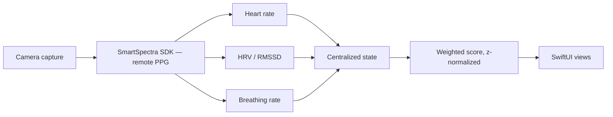

VitalEdge is a SwiftUI iOS app that reads your vitals from a camera recording and returns a physical and mental readiness check for the day. No wearable, no strap — just the phone's camera.

## What it does

- Streams heart rate, HRV (RMSSD), and breathing rate in real time while a capture is running.
- Turns those signals into a physical and mental readiness check for the day.

## How it's built

- Signal extraction is the SmartSpectra SDK (remote PPG) by [Presage](https://presagetech.com/). Measuring physiology from video is an open research problem — better to buy that and own the product around it.
- Heart rate in bpm, RMSSD in milliseconds, and breaths per minute aren't comparable, so each is z-score normalized before a weighted recovery scoring algorithm turns them into readiness metrics.
- Streamed samples land in centralized state and the score is derived once from there — no recomputing the same math on every sample, no two parts of the screen disagreeing mid-capture.
- API-failure fallbacks, so a failed call degrades instead of stalling on a half-populated reading.

## Tradeoffs

- Camera instead of wearable removes the hardware barrier and gives up continuity. A capture describes the moment you took it, not your whole night.
- Remote PPG is sensitive to lighting, motion, framing, and distance. A wearable gets a clean signal for free; a camera earns it from whatever the room gives.

## Demo

<TodoBlock />
