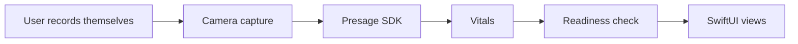

## Problem

A readiness score — the "train hard today or back off" number — normally costs you a wearable. Something to buy, charge, wear overnight, and remember to put back on. VitalEdge is a SwiftUI iOS app that gets to the same answer from the phone you already own: you take a recording of yourself, the app reads your vitals from it, and it gives you a physical and mental readiness check before you start your day.

The hard part isn't showing the number. Reading vitals from video means reading light — the small color shifts in skin as blood moves through it — and that technique is inherently sensitive to things a normal app never has to think about. Room lighting. Whether the subject held still. Camera angle. Distance. A wearable sidesteps all of it by being strapped to you; it gets a clean signal for free. A camera has to earn the same signal from whatever the room happens to give it.

## Approach

The signal extraction comes from the [Presage](https://presagetech.com/) SDK, which turns a video capture into vitals. <Todo>which vitals it returns, and which ones you actually use.</Todo> That boundary was deliberate: measuring physiology from video is an open research problem, and rolling my own would have been the kind of thing that looks impressive in a repo and is wrong in production. Buy the research problem, own the product around it.

What that leaves is a set of problems the SDK does not solve for you.

- **Capture conditions are a UX problem before they are a data problem.** You cannot repair a bad recording after the fact; you can only ask for another one, and every retake is a tax on someone who is trying to get out the door. <Todo>what the app does about capture conditions, if anything — coaching, retakes, or nothing yet.</Todo>
- **A derived number has to be legible to be trusted.** Readiness isn't measured, it's computed from things that are, and a bare score with no way to see what drove it is how health apps lose people. <Todo>how readiness is computed — which inputs, weighted how, against what baseline.</Todo>
- **The input is a living person, which makes automated testing genuinely awkward.** You can't check a heartbeat into a repo. <Todo>how you test this, if at all.</Todo>

## Architecture

What I can state plainly is short:

<Todo>the layers between the SDK and the views — where a reading lives once Presage hands it back, whether anything persists, and whether anything sits between the vendor's types and the rest of the app.</Todo> That last one is the piece I would want a reviewer to ask about, because a vendor SDK sitting in the middle of an app is either a seam you can swap or a dependency wired through everything, and which one it is only shows up when you try to change it.

## Key tradeoff

Camera instead of wearable is the whole bet, and it cuts both ways. It removes every adoption barrier — no purchase, no charging, no strap — which is the entire reason the app is worth building. What it gives up is continuity. A wearable samples you all night and all day; a recording tells you about the moment you took it, under the conditions you took it in. That is a thinner dataset, and no amount of good engineering downstream makes it thicker.

So I would rather the product be narrow than oversell. "How ready are you right now, given a good capture" is a real question worth answering honestly. <Todo>the limitation you decided to state in-product, and where the user sees it.</Todo> The temptation with health data is to present an inferred number with the same confidence as a measured one. A readiness score that quietly overstates itself is worse than no score, because someone makes real decisions about their day on top of it.

## Demo

A recording would show a full morning check on a physical iPhone: opening the app, taking the capture, and the vitals and readiness result coming back. <Todo>whether you can also show a degraded capture, and what the app does with one.</Todo>

<TodoBlock />
